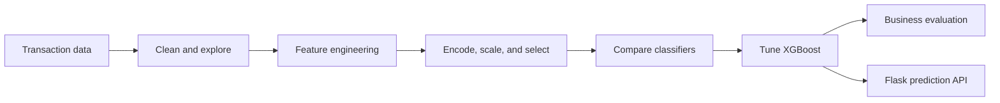

# Transaction Fraud Detection
<p align="center">
  
</p>

<p align="center"><em>Project-themed banner generated from an internet-hosted image service for a cleaner GitHub presentation.</em></p>

An end-to-end data science project for identifying fraudulent mobile-money transactions and estimating the business impact of model decisions.


## Overview

The project investigates a highly imbalanced transaction dataset, engineers fraud-related features, compares several classifiers, tunes XGBoost, and packages the fitted preprocessing and model artifacts for a Flask prediction endpoint.

## Project Pipeline



## Models Compared

- Dummy baseline
- Logistic Regression
- K-Nearest Neighbors
- Support Vector Machine
- Random Forest
- XGBoost
- LightGBM

Because fraud is rare, the analysis emphasizes balanced accuracy, precision, recall, F1, and Cohen’s kappa rather than ordinary accuracy alone.

## Results

XGBoost was selected as the final model.

| Evaluation | Balanced accuracy | Precision | Recall | F1 | Kappa |
|---|---:|---:|---:|---:|---:|
| Cross-validation | 0.881 ± 0.017 | 0.963 ± 0.007 | 0.763 ± 0.035 | 0.851 ± 0.023 | 0.851 ± 0.023 |
| Held-out data | 0.915 | 0.944 | 0.829 | 0.883 | 0.883 |

The notebook also applies a project-specific revenue and loss formula to translate prediction outcomes into an estimated business result.

## Key Analysis Findings

- fraud transactions in the sample occur in `TRANSFER` and `CASH_OUT` operations
- the fraud class represents less than 1% of records
- class-sensitive metrics reveal model differences that raw accuracy obscures
- false negatives carry the largest cost under the project’s business assumptions

## Deployment Interface

`api/handler.py` exposes:

```http
POST /fraud/predict
Content-Type: application/json
```

The endpoint accepts one transaction object or a list, applies the saved preprocessing pipeline, and returns model predictions.

## Tech Stack

- Python
- Pandas, NumPy, and SciPy
- scikit-learn
- XGBoost and LightGBM
- Boruta and category-encoders
- Matplotlib and Seaborn
- Flask
- Joblib

## Project Structure

```text
.
|-- notebooks/
|   `-- transaction-fraud-detection-cycle1.ipynb
|-- api/
|   |-- handler.py
|   `-- fraud/Fraud.py
|-- data/raw/
|-- models/
|-- functions/
|-- reports/figures/
|-- requirements.txt
`-- README.md
```

## Installation and Usage

The repository pins an older data-science stack. A Python version compatible with those package releases is recommended.

```bash
git clone https://github.com/guru8880/transaction-fraud-detection.git
cd transaction-fraud-detection
python -m venv venv
```

```bash
# Windows
venv\Scripts\activate

# macOS/Linux
source venv/bin/activate
```

```bash
pip install -r requirements.txt
jupyter notebook notebooks/transaction-fraud-detection-cycle1.ipynb
```

The API code and serialized artifacts use historical file names that are not fully aligned (`cycle` versus `cycle1`). Review those paths before starting `api/handler.py`.

## Limitations

- the financial calculations depend on hypothetical business rules
- model evaluation is based on one dataset and time period
- data and concept drift are not monitored
- serialized artifacts and API paths need consolidation
- fraud predictions should support, not replace, a broader review and risk process

## Future Improvements

- align artifact names and add an API smoke test
- add threshold optimization based on fraud cost
- use time-aware validation and drift monitoring
- improve probability calibration and explainability
- containerize the inference service
